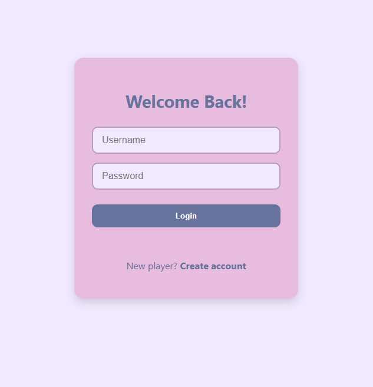
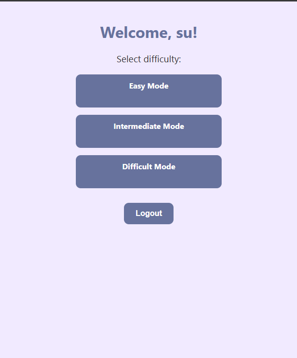
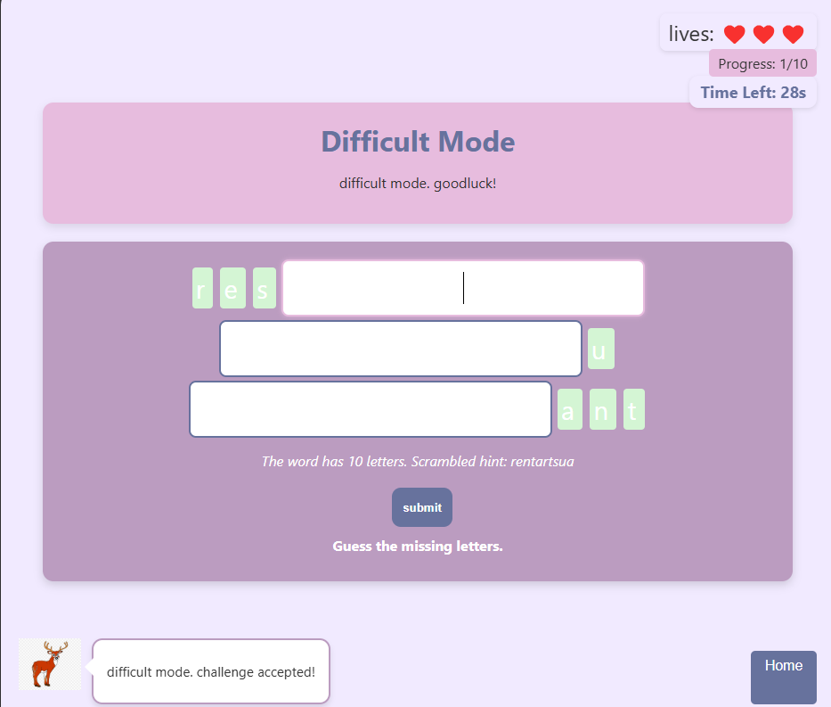

# Simple Word Game

A beautiful, responsive browser-based word guessing game built with vanilla JavaScript, HTML, and CSS. Test your vocabulary skills by guessing missing letters in words across three difficulty levels. Features user authentication, score tracking, and an interactive assistant to guide you through the game.

**Live Demo:** [mboso.netlify.app](https://mboso.netlify.app)

## Screenshots

### Login and Signup Page



### Main Menu



### Gameplay with Assistant


## How to Play

1. **Sign Up**: Create a new account on the signup page
2. **Login**: Enter your credentials to access the game
3. **Choose Difficulty**: Select Easy, Intermediate, or Difficult mode
4. **Guess Letters**: Fill in the missing letters in the word
5. **Submit**: Click the submit button to check your answer
6. **Progress**: Complete all words in a difficulty level to unlock the next level
7. **Track Scores**: Your high scores are saved automatically


##  Customization

### Adding New Words
Edit the `wordBanks` object in `app.js`:
```javascript
const wordBanks = {
  easy: ["your", "words", "here"],
  intermediate: ["your", "words", "here"],
  difficult: ["your", "words", "here"]
};
```

### Changing Colors
Modify the color values in `style.css`:
- Primary background: `#F1EAFF`
- Secondary: `#E7BCDE`
- Accent: `#BB9CC0`
- Dark: `#67729D`

### Adjusting Difficulty
Modify these values in `app.js`:
- Number of missing letters per difficulty
- Timer duration (currently 30 seconds)
- Number of lives (currently 3)


